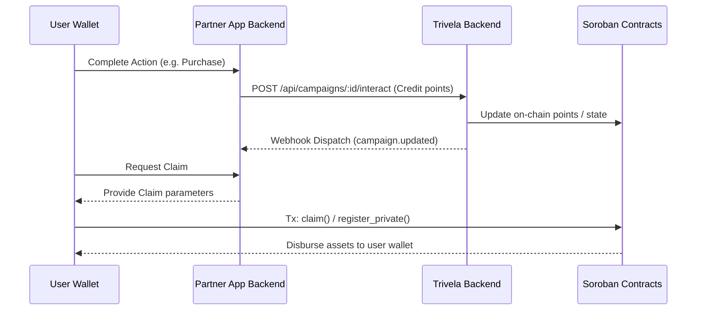

# Trivela Integrator Guide: Embedding Rewards in Third-Party Apps

This guide walks partners and developers through embedding **Trivela rewards** into their own
applications. By integrating Trivela, you can reward users with Stellar-native assets (like XLM or
custom tokens) when they complete actions (such as making a purchase, completing a task, or reaching
a milestone) in your app.

---

## 🏗️ Architecture Overview

The integration relies on three main parts:

1. **Your App (Frontend & Backend)**: Triggers user events and handles custom rewards experiences.
2. **Trivela Backend API**: Manages metadata, verifies claims, and registers on-chain Soroban
   interactions.
3. **Soroban Smart Contracts**: Enforces campaign rules and handles trustless on-chain claiming.



---

## 🚀 Step 1: SDK & Type Setup

To ensure type-safety when interacting with the Trivela REST API, install `@trivela/client` in your
project:

```bash
npm install @trivela/client
```

This package contains TypeScript typings for all request and response payloads, ensuring error-free
communication with the Trivela Backend.

---

## 🔧 Step 2: Creating a Campaign

First, set up a campaign via the Trivela Admin Dashboard or programmatically. To do it
programmatically, use your organization's API credentials to hit the Trivela Backend:

```typescript
import type { CampaignCreate } from '@trivela/client';

async function createRewardCampaign() {
  const response = await fetch('https://api.trivela.com/api/v1/campaigns', {
    method: 'POST',
    headers: {
      'Content-Type': 'application/json',
      Authorization: `Bearer ${process.env.TRIVELA_API_KEY}`,
    },
    body: JSON.stringify({
      name: 'Partnership Rewards Program',
      description: 'Earn rewards for completing milestones.',
      reward_xlm: 5,
      max_participants: 500,
      admin_public_key: process.env.ADMIN_PUBLIC_KEY,
    } as CampaignCreate),
  });

  const campaign = await response.json();
  console.log(`Campaign created successfully: ${campaign.id}`);
  return campaign.id;
}
```

---

## 👥 Step 3: Registering Participants

Before users can accumulate points, they must be registered as active participants in your campaign.
Register them when they opt-in or connect their wallet in your app:

```typescript
async function enrollUser(campaignId: string, userWalletAddress: string) {
  const response = await fetch(`https://api.trivela.com/api/v1/campaigns/${campaignId}/register`, {
    method: 'POST',
    headers: {
      'Content-Type': 'application/json',
      Authorization: `Bearer ${process.env.TRIVELA_API_KEY}`,
    },
    body: JSON.stringify({
      wallet_address: userWalletAddress,
    }),
  });

  if (!response.ok) {
    throw new Error('Failed to enroll user in rewards campaign');
  }
}
```

---

## ⚡ Step 4: Awarding Rewards (Interactions)

When a user performs a key action in your app, notify the Trivela API to record the interaction and
update their on-chain points:

```typescript
async function rewardUserAction(campaignId: string, userWalletAddress: string, actionType: string) {
  const response = await fetch(`https://api.trivela.com/api/v1/campaigns/${campaignId}/interact`, {
    method: 'POST',
    headers: {
      'Content-Type': 'application/json',
      Authorization: `Bearer ${process.env.TRIVELA_API_KEY}`,
    },
    body: JSON.stringify({
      wallet_address: userWalletAddress,
      action: actionType,
      value: 10, // credit 10 points
    }),
  });

  if (response.ok) {
    console.log(`Credited points to ${userWalletAddress} for action: ${actionType}`);
  }
}
```

---

## 🔒 Step 5: Webhook Signature Verification

Trivela dispatches HTTP POST webhooks to your backend whenever campaign events or claims occur. To
prevent replay attacks and spoofing, you **must** verify the payload's signature using the signing
secret provided in the Trivela dashboard.

Install `@trivela/webhook-verify` to perform a timing-safe signature comparison:

```bash
npm install @trivela/webhook-verify
```

Here is how to set up signature verification in a Node.js server:

```javascript
import { constructEvent } from '@trivela/webhook-verify';
import express from 'express';

const app = express();

// Use express.raw() to get the raw string body (necessary for cryptographic signature verification)
app.post('/api/webhooks/trivela', express.raw({ type: 'application/json' }), (req, res) => {
  const signature = req.headers['x-trivela-signature'];
  const secret = process.env.TRIVELA_WEBHOOK_SECRET;

  let event;
  try {
    // Verifies and parses the payload raw string body against the signature
    event = constructEvent(req.body.toString('utf8'), signature, secret);
  } catch (err) {
    console.error(`[Webhook Signature Failed]: ${err.message}`);
    return res.status(400).send(`Webhook verification failed: ${err.message}`);
  }

  // Handle the event payload
  console.log(`Received verified webhook event: ${event.type}`);
  switch (event.type) {
    case 'campaign.updated':
      // Handle campaign state updates
      break;
    default:
      console.log(`Unhandled webhook event type: ${event.type}`);
  }

  res.sendStatus(200);
});
```

---

## 🛡️ Step 6: Frontend Claims & ZK Proofs

For private campaigns, users claim rewards using zero-knowledge proofs so their identities are kept
completely confidential on-chain.

To generate a ZK proof in the browser without locking the main thread, use the Web Worker prover
package `@trivela/sdk/zk`:

```typescript
import { generateClaimProof, isZkSupported } from '@trivela/sdk/zk';

async function handlePrivateRewardClaim(userSecret: string, amount: number) {
  if (!isZkSupported()) {
    throw new Error('Zero-knowledge proofs are not supported in this browser.');
  }

  // 1. Generate the ZK claim proof inputs
  const inputs = {
    secret: userSecret,
    claimAmount: amount,
  };

  try {
    // 2. Generate the proof (runs off-thread in a Web Worker)
    const proof = await generateClaimProof(inputs, {
      onProgress: (percent) => console.log(`Proving progress: ${percent}%`),
    });

    // 3. Submit proof bytes and nullifier directly to the campaign contract
    await submitToSorobanContract(proof.nullifier, proof.proofBytes);
    console.log('Private claim successfully registered!');
  } catch (error) {
    console.error('Failed to generate ZK claim proof:', error);
  }
}
```

---

## 🧪 Runnable Examples

For a fully interactive, local setup demonstrating this end-to-end integration flow, explore the
`examples/` folder in the repository:

- **[Point-Based Loyalty Example](../examples/loyalty/README.md)**: A complete, runnable simulation
  of campaign creation, participant registration, point accumulation, and claim processing using the
  REST API.
- **[Partner Webhook & ZK Integration](../examples/partner-integration/README.md)**: Demonstrates
  setting up a backend webhook verification server and launching ZK browser integrations.
